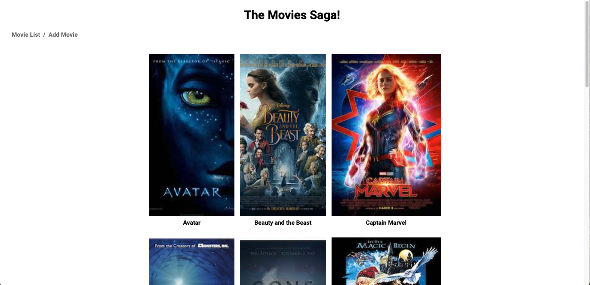
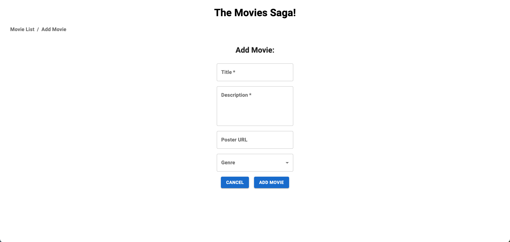

# Project Name

Weekend at the Movies

## Description

Duration: Weekend sprint.

This app displays a list of movies to the user. When a movie poster is clicked the details for the movie are displayed. The user is allowed to navigate through the page and can opt to add a movie with information for the title, a poster url, description, and one genre selection.

## Prerequisites
Node.js
Express.js
postgresql

## Built With
Express https://expressjs.com/en/starter/installing.html
PG https://www.postgresql.org/download/
Node https://nodejs.org/en/download/
Axios https://axios-http.com/docs/intro
Material UI https://mui.com/getting-started/usage/

## Installation

1. Create a database named 'saga_movies_weekend'
2. The queries in the data.sql file are set up to create all the necessary tables and populate the needed data to allow the application to run correctly. The project is built on Postgres, so you will need to make sure to have that installed. We recommend using Postico to run those queries as that was used to create the queries.
3. Open up your editor of choice and run an npm install
4. Run npm run server in your terminal
5. Run npm run client in your terminal
6. The npm run client command will open up a new browser for you!

## Screenshots

